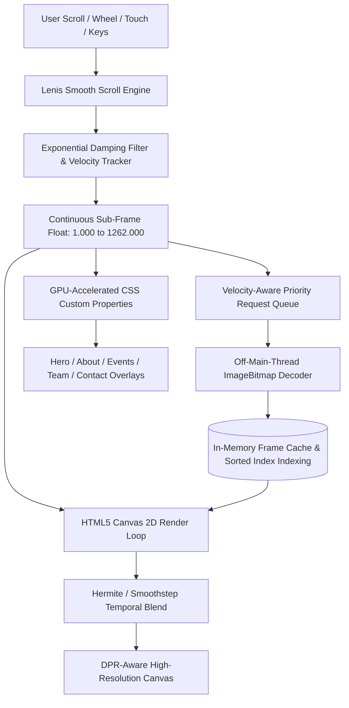

<div align="center">

  

  # E-Cell Woxsen — Where Builders Start
  
  **The Official Digital Experience of the Entrepreneurship Cell at Woxsen University**

  [](https://nextjs.org/)
  [](https://react.dev/)
  [](https://www.typescriptlang.org/)
  [](https://tailwindcss.com/)
  [](https://lenis.darkroom.engineering/)
  [](https://bun.sh/)

  <p align="center">
    A cinematic, frame-by-frame 120 FPS scrollytelling platform engineered to showcase student ventures, flagship initiatives, leadership, and startup culture at Woxsen University.
  </p>

  <p align="center">
    <a href="#-overview">Overview</a> •
    <a href="#-key-features">Key Features</a> •
    <a href="#-scrollytelling-engine-architecture">Engine Architecture</a> •
    <a href="#-timeline--cinematic-chapters">Cinematic Chapters</a> •
    <a href="#-tech-stack">Tech Stack</a> •
    <a href="#-project-structure">Project Structure</a> •
    <a href="#-getting-started">Getting Started</a> •
    <a href="#-performance--engineering">Performance</a> •
    <a href="#-connect--community">Community</a>
  </p>

</div>

---

## 🌟 Overview

**E-Cell Woxsen** is built on a simple premise: *we build founders, not just businesses.* 

This web platform bridges physical architecture and digital storytelling through a custom **Sub-Frame Canvas Scrollytelling Engine**. As the user scrolls, 1,262 high-definition 3D WebP render frames, ambient video loops, generative Web Audio synth pads, and hardware-accelerated DOM overlays synchronize in real time to create an editorial, tactile exhibition experience across campus initiatives, flagship events, leadership, and community pathways.

---

## ✨ Key Features

- 🎞️ **Sub-Frame Canvas Scrollytelling**: High-performance HTML5 2D canvas playback mapped over **1,262 ultra-sharp WebP frames** with continuous Hermite / Smoothstep temporal blending for zero-stutter transitions.
- 🌊 **Inertial Momentum Scrolling**: Integrated with **Lenis** using time-invariant exponential damping for natural scroll physics across trackpads, mice, and touch devices.
- ⚡ **Multi-Tier Priority Streaming & Queue Management**:
  - **Critical Fast Boot**: Loads initial frames to render interactive hero visuals in `< 250ms`.
  - **Skeleton Keyframe Stream**: Strided background sampling ensuring a nearby frame is always cached.
  - **Velocity & Direction-Aware Queue**: Actively predicts user scroll direction and velocity, assigning priority tiers (`1000` to `300`) with HTTP/2 concurrent stream throttling (6 simultaneous requests max).
  - **Off-Main-Thread Decoding**: Utilizes `createImageBitmap` and `HTMLImageElement.decode()` to eliminate main-thread UI hitches during intensive decoding.
- 🎬 **Seamless Ambient Video Crossfade**: Looping ambient video (`still_shot.mp4`) seamlessly dissolves into the canvas timeline at the hero state for instant visual immersion before the first scroll interaction.
- 🎵 **Generative Web Audio Soundscape**: Built-in procedural ambient synthesizer (`AudioController.tsx`) featuring polyphonic warm sine/triangle oscillator pads, detuned harmonics, and low-frequency breathing modulation.
- 🧭 **Real-Time Timeline HUD & Navigation**:
  - **Floating Pill Navbar (`Header.tsx`)**: Real-time section tracking, logo badge reset, and programmatic smooth jumps to chapters.
  - **Live Progress HUD (`ScrollProgressHUD.tsx`)**: Real-time chapter indicators (`CH 01` to `CH 06`), percentage counter, and progress gauge.
- 🏛️ **Cinematic Overlay Systems**:
  - **Hero Landing (Frames 1–35)**: Staggered typography letter-reveal, ambient emerald glow, and primary CTAs.
  - **3-Column Architectural Story (Frames 350–425)**: Core pillars (*Build First*, *Venture Incubation*, *Capital Network*) with localized radial contrast grading.
  - **Continuous Wall Gallery (Frames 598–1262)**: Smooth horizontal camera tracking across Flagship Events, Core Leadership, and the Contact Hub.
- 📋 **Multi-Track Application & Idea Submission**: Glassmorphic modal (`JoinApplyModal.tsx`) with specialized intake paths for student membership, startup idea pitches, and corporate partnerships.
- 📄 **Institutional Resource Access**: Direct one-click download for the official *E-Cell Woxsen Service Portfolio* PDF.

---

## 📐 Scrollytelling Engine Architecture



### Hermite Sub-Frame Interpolation
Rather than discrete frame snapping, the engine continuously calculates Hermite / Smoothstep curve weights between adjacent keyframes `Frame A` and `Frame B`:

$$S(t) = 3t^2 - 2t^3 \quad \text{where} \quad t = \text{frame}_{\text{current}} - \lfloor \text{frame}_{\text{current}} \rfloor$$

This produces seamless cross-dissolves at 60Hz, 120Hz, and high-refresh displays.

### Zero-Reflow GPU Transform Pipeline
Overlay positions and opacities are synced to canvas frames using CSS Custom Properties updated via `requestAnimationFrame`:
```css
/* Dynamically bound CSS variables */
--gallery-tx: -2450px;
--gallery-opacity: 1;
--hero-opacity: 0;
--door-opacity: 1;
```
This bypasses React re-render cycles during rapid scrolling and delegates layout updates directly to the browser compositor thread.

---

## 🗺️ Timeline & Cinematic Chapters

| Chapter | Frame Range | Section | Visual Scene & Experience |
| :---: | :--- | :--- | :--- |
| **01** | **`0001` – `0035`** | **Hero Section** | Cinematic camera establishing shot with ambient video overlay, display typography, and dual CTAs. |
| **02** | **`0350` – `0425`** | **About / The Doorway** | 3-Column architectural layout detailing E-Cell's vision, core incubation pillars, and campus footprint. |
| **03** | **`0425` – `0598`** | **Inside Headquarters** | Camera travels through the physical innovation corridor into the exhibition space. |
| **04** | **`0598` – `0860`** | **Flagship Initiatives** | Horizontal gallery showcasing **Hult Prize**, **Panel Discussion**, and **Game Night** with dynamic spotlight illumination. |
| **05** | **`0860` – `1140`** | **Core Leadership Wall** | Executive leadership, advisory board, secretaries, and department leads presented in curated contact sheets. |
| **06** | **`1140` – `1262`** | **Community & Connect** | Architectural contact wall with direct inquiry form, social channels, campus coordinates, and Service Portfolio download. |

---

## 🛠️ Tech Stack

| Category | Technology | Purpose |
| :--- | :--- | :--- |
| **Framework** | [Next.js 16.3.1](https://nextjs.org/) (App Router, Turbopack) | Server & Client component architecture, asset optimization |
| **UI Library** | [React 19.2.8](https://react.dev/) | Component lifecycle, state synchronization, concurrent rendering |
| **Language** | [TypeScript 5](https://www.typescriptlang.org/) | Strict type safety and complete interface definitions |
| **Styling** | [Tailwind CSS v4](https://tailwindcss.com/) + PostCSS | Modern CSS utility tokens, custom animations, glassmorphism |
| **Smooth Scroll** | [Lenis 1.3.26](https://lenis.darkroom.engineering/) | Inertial momentum scrolling with customizable damping |
| **Audio Engine** | Web Audio API | Procedural, zero-bandwidth polyphonic ambient sound synthesizer |
| **Icons** | [Lucide React](https://lucide.dev/) | Crisp, modern vector UI iconography |
| **Typography** | `Bebas Neue`, `DM Sans`, `Space Mono` | Display, body, and technical mono font pairing |
| **Runtime & PM** | [Bun 1.3.12](https://bun.sh/) / Node.js | Fast package management, bundling, and local development |

---

## 📁 Project Structure

```text
ecell_new_website/
├── app/
│   ├── components/
│   │   ├── Header.tsx                 # Glassmorphic floating pill navbar with frame jumps
│   │   ├── PreloadManager.tsx         # Splash screen with frame progress & neon pulse
│   │   ├── ScrollytellingEngine.tsx   # Canvas render loop, queue manager, Lenis & Hermite blending
│   │   ├── modals/
│   │   │   └── JoinApplyModal.tsx     # Multi-track application modal (Student / Startup / Partner)
│   │   ├── overlays/
│   │   │   ├── HeroOverlay.tsx        # Hero headline with staggered character animation
│   │   │   ├── DoorAboutOverlay.tsx   # About story & 3-column architectural pillar layout
│   │   │   ├── WallGalleryOverlay.tsx # Horizontal tracking container for gallery sections
│   │   │   ├── EventsWallSection.tsx  # Flagship events with spotlight shaders & photo frames
│   │   │   ├── EventsWallCard.tsx     # Alternative event cards grid with quick pitch CTA
│   │   │   ├── TeamWallSection.tsx    # Comprehensive leadership & member contact sheets
│   │   │   ├── TeamWallCards.tsx      # Alternative modular core team grid component
│   │   │   ├── ContactWallSection.tsx # Architectural contact wall with integrated inquiry form
│   │   │   └── ContactWallCard.tsx    # Modular contact card with campus metadata & social links
│   │   └── ui/
│   │       ├── AudioController.tsx    # Procedural Web Audio synthesizer for ambient soundscape
│   │       └── ScrollProgressHUD.tsx  # Real-time chapter tracker, frame counter & timeline gauge
│   ├── globals.css                    # Tailwind CSS v4 setup, custom fonts & glass styles
│   ├── layout.tsx                     # Root HTML structure, OpenGraph metadata & Google Fonts
│   └── page.tsx                       # Master page coordinator & state bridge
├── public/
│   ├── ecell_shots/                   # 1,262 high-resolution sequence frames (WebP)
│   ├── ecell_shots_720p/              # Lightweight responsive fallback frames
│   ├── events/                        # Flagship event exhibition imagery
│   ├── ecell-logo.png                 # Official E-Cell brand insignia
│   ├── still_shot.mp4                 # Ambient looping video for hero background
│   └── ECell_Woxsen_ServicePortfolio.pdf # Official E-Cell portfolio document
├── package.json                       # Scripts, dependencies & trusted binary configs
├── tsconfig.json                      # Strict TypeScript compiler options
└── next.config.ts                     # Next.js configuration
```

---

## 🚀 Getting Started

### Prerequisites

Ensure you have one of the following installed on your machine:
- **[Bun](https://bun.sh/)** *(Recommended for fastest install & build times)*
- **[Node.js](https://nodejs.org/)** (v18.18+ or v20+)

### 1. Clone the Repository

```bash
git clone git@github.com:ecell-woxsen/ecell-new-website.git
cd ecell-new-website
```

### 2. Install Dependencies

Using **Bun**:
```bash
bun install
```

Or using **npm**:
```bash
npm install
```

### 3. Run Development Server

```bash
bun dev
# or
npm run dev
```

Open [http://localhost:3000](http://localhost:3000) in your browser to explore the experience.

### 4. Build for Production

```bash
bun run build
bun run start
# or
npm run build
npm run start
```

### 5. Linting & Validation

```bash
bun run lint
# or
npm run lint
```

---

## ⚡ Performance & Engineering

- **Off-Main-Thread Decoding**: Frames are fetched and parsed via `createImageBitmap` into GPU textures off the main thread, maintaining fluid frame rates during rapid scrolling.
- **Binary Search Keyframe Resolution**: Nearest loaded keyframe resolution uses $O(\log N)$ binary search across a sorted index array for immediate frame fallback.
- **High-DPR Aspect Ratio Fit**: Canvas sizing dynamically computes `devicePixelRatio` and letterbox/cover aspect ratio fit to ensure crisp rendering on 4K, Retina, and mobile viewports.
- **GPU-Accelerated Compositing**: All spatial movements (`--gallery-tx`, `--hero-ty`) use `translate3d()` transforms to avoid triggering CPU paint cycles.

---

## 🤝 Connect & Community

- **Campus Address**: Woxsen University, Sadasivpet, Hyderabad, Telangana 502345, India
- **Email**: [ecell@woxsen.edu.in](mailto:ecell@woxsen.edu.in)
- **Instagram**: [@ecell_wou](https://instagram.com/ecell_wou) / [@ecell_woxsen](https://instagram.com/ecell_woxsen)
- **LinkedIn**: [E-Cell Woxsen University](https://linkedin.com/company/ecell-woxsen)
- **Website**: [woxsen.edu.in/ecell](https://woxsen.edu.in/ecell)

---

<div align="center">
  <sub>Engineered & Designed with ❤️ by the <strong>E-Cell Woxsen Team</strong>.</sub>
</div>
