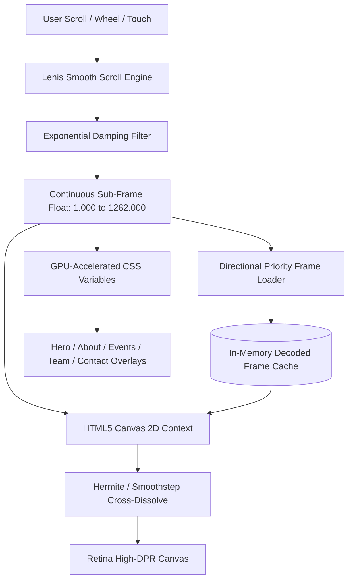

<div align="center">

  

  # E-Cell Woxsen — Where Builders Start
  
  **The Official Digital Experience of the Entrepreneurship Cell at Woxsen University**

  [](https://nextjs.org/)
  [](https://react.dev/)
  [](https://www.typescriptlang.org/)
  [](https://tailwindcss.com/)
  [](https://lenis.darkroom.engineering/)

  <p align="center">
    A cinematic, frame-by-frame scrollytelling web experience engineered to showcase student ventures, flagship initiatives, leadership, and startup culture at Woxsen University.
  </p>

  <p align="center">
    <a href="#-key-features">Key Features</a> •
    <a href="#-scrollytelling-engine-architecture">Engine Architecture</a> •
    <a href="#-timeline--frame-zones">Frame Zones</a> •
    <a href="#-tech-stack">Tech Stack</a> •
    <a href="#-getting-started">Getting Started</a> •
    <a href="#-project-structure">Project Structure</a>
  </p>

</div>

---

## 🌟 Overview

**E-Cell Woxsen** is built on a simple premise: *we build founders, not just businesses.* 

This web platform bridges physical space and digital storytelling through a custom **120 FPS Sub-Frame Scrollytelling Engine**. As the user scrolls, high-fidelity 3D frames, ambient video loops, and dynamic DOM overlays synchronize seamlessly to create an editorial, tactile exhibition experience across campus initiatives, flagship events, and community pathways.

---

## ✨ Key Features

- 🎞️ **Sub-Frame Canvas Scrollytelling**: High-performance HTML5 2D canvas playback mapped over 1,262 ultra-sharp WebP frames with continuous Hermite/Smoothstep temporal blending.
- 🌊 **Inertial Momentum Scrolling**: Powered by **Lenis** with time-invariant exponential damping for butter-smooth navigation across desktop and mobile devices.
- ⚡ **Multi-Tier Progressive Frame Streaming**:
  - **Critical Fast Boot**: Loads initial frames in under ~300ms.
  - **Skeleton Keyframe Stream**: Fast background sampling across the full 1,262 frame timeline.
  - **Directional Lookahead Buffer**: Actively decodes frames ahead of the user's scroll direction using off-main-thread image decoding (`img.decode()`).
- 🎬 **Seamless Ambient Video Blend**: Video crossfades dynamically into the canvas timeline at the hero state for an immediate alive-feel before any scroll interaction.
- 🏛️ **Cinematic Overlay Systems**:
  - **Hero Landing (Frames 1–35)**: Bold display typography, interactive CTAs, and ambient glow.
  - **3-Column Architectural Story (Frames 350–425)**: Core pillars (*Build First*, *Venture Incubation*, *Capital Network*) with localized radial grading.
  - **Continuous Wall Gallery (Frames 598–1262)**: Smooth horizontal camera tracking across Flagship Events, Leadership Sheets, and the Community Hub.
- 📋 **Interactive Application & Idea Submission**: Glassmorphic modal flow supporting idea pitches, student membership applications, and strategic partnership requests.
- 🎯 **Frame-Aware Floating Navigation**: Glassmorphic pill navbar with real-time frame tracking, programmatic smooth jumps, and responsive mobile drawer.
- 📄 **Direct Portfolio & Resource Access**: Built-in institutional download for the E-Cell Woxsen Service Portfolio.

---

## 📐 Scrollytelling Engine Architecture



### Hermite Sub-Frame Interpolation
Rather than snapping between discrete image frames, the engine calculates a smooth Hermite curve ($3t^2 - 2t^3$) between `Frame A` and `Frame B` to achieve zero-stutter transitions at 60–120Hz refresh rates.

---

## 🗺️ Timeline & Frame Zones

| Frame Range | Section | Visual Scene & Experience |
| :--- | :--- | :--- |
| **`0001` – `0035`** | **Hero Section** | Cinematic camera establishing shot with ambient video overlay, display branding, and primary CTAs. |
| **`0350` – `0425`** | **About / The Doorway** | 3-Column architectural layout detailing E-Cell's vision, core pillars, and campus incubation stats. |
| **`0598` – `0860`** | **Flagship Events** | Horizontal gallery showcasing **Hult Prize**, **Panel Discussion**, and **Game Night** with dynamic spotlight illumination. |
| **`0860` – `1140`** | **Team & Leadership Wall** | Executive leadership, advisory board, and core team members presented in curated contact sheets. |
| **`1140` – `1262`** | **Community & Connect** | Direct inquiry form, social channels, campus coordinates (Hyderabad), and Service Portfolio download. |

---

## 🛠️ Tech Stack

- **Framework**: [Next.js 16.3.1](https://nextjs.org/) (App Router, Turbopack)
- **Library**: [React 19](https://react.dev/)
- **Language**: [TypeScript 5](https://www.typescriptlang.org/)
- **Styling**: [Tailwind CSS v4](https://tailwindcss.com/) + PostCSS
- **Smooth Scroll**: [Lenis](https://lenis.darkroom.engineering/)
- **Icons**: [Lucide React](https://lucide.dev/)
- **Typography**: `Bebas Neue` (Display), `DM Sans` (Body), `Space Mono` (Accents & Monospace)
- **Package Manager**: [Bun](https://bun.sh/) / [npm](https://www.npmjs.com/)

---

## 🚀 Getting Started

### Prerequisites

Ensure you have one of the following installed:
- [Node.js](https://nodejs.org/) (v18.18+ or v20+)
- [Bun](https://bun.sh/) *(Recommended)*

### 1. Clone the Repository

```bash
git clone git@github.com:ecell-woxsen/ecell-new-website.git
cd ecell-new-website
```

### 2. Install Dependencies

Using **Bun**:
```bash
bun install
```

Or using **npm**:
```bash
npm install
```

### 3. Run Development Server

```bash
bun dev
# or
npm run dev
```

Open [http://localhost:3000](http://localhost:3000) in your browser to experience the site.

### 4. Build for Production

```bash
bun run build
bun run start
# or
npm run build
npm run start
```

---

## 📁 Project Structure

```text
ecell_new_website/
├── app/
│   ├── components/
│   │   ├── Header.tsx                 # Glassmorphic floating pill navbar
│   │   ├── PreloadManager.tsx         # Initial boot loader & progress indicator
│   │   ├── ScrollytellingEngine.tsx   # Canvas render loop, Lenis integration & streaming
│   │   ├── modals/
│   │   │   └── JoinApplyModal.tsx     # Multi-step idea submission & application modal
│   │   ├── overlays/
│   │   │   ├── HeroOverlay.tsx        # Hero headline & action buttons
│   │   │   ├── DoorAboutOverlay.tsx   # About story & 3-column pillar layout
│   │   │   ├── WallGalleryOverlay.tsx # Horizontal scroll container for events, team, contact
│   │   │   ├── EventsWallSection.tsx  # Flagship events cards with spotlight shaders
│   │   │   ├── TeamWallSection.tsx    # Leadership & member contact sheets
│   │   │   └── ContactWallSection.tsx # Contact form, social links & campus location
│   │   └── ui/
│   │       ├── AudioController.tsx    # Ambient audio controller
│   │       └── ScrollProgressHUD.tsx  # Frame & timeline progress HUD
│   ├── globals.css                    # Tailwind CSS imports and custom utility styles
│   ├── layout.tsx                     # Root HTML structure, fonts & metadata
│   └── page.tsx                       # Master page coordinator
├── public/
│   ├── ecell_shots/                   # 1,262 high-resolution sequence frames (WebP)
│   ├── events/                        # Event exhibition photos
│   ├── ecell-logo.png                 # E-Cell official brand mark
│   ├── still_shot.mp4                 # Ambient looping video
│   └── ECell_Woxsen_ServicePortfolio.pdf # Official E-Cell portfolio document
├── package.json
└── tsconfig.json
```

---

## ⚡ Performance Highlights

- **Off-Main-Thread Decoding**: Frames are parsed asynchronously using `HTMLImageElement.decode()` to eliminate UI thread hitches.
- **Hardware-Accelerated Transforms**: Overlays utilize CSS Custom Properties (`--gallery-tx`, `--hero-opacity`, `--door-opacity`) updated synchronously within a single `requestAnimationFrame` loop.
- **Zero Layout Shifts**: Canvas and video viewports are fixed-positioned and dynamically scaled using DPR-aware aspect ratio fit.

---

## 🤝 Community & Connect

- **Location**: Woxsen University, Hyderabad, Telangana, India
- **Instagram**: [@ecell_woxsen](https://instagram.com/ecell_woxsen)
- **LinkedIn**: [E-Cell Woxsen University](https://linkedin.com/company/ecell-woxsen)
- **Email**: [ecell@woxsen.edu.in](mailto:ecell@woxsen.edu.in)

---

<div align="center">
  <sub>Designed & Developed with ❤️ by the <strong>E-Cell Woxsen Team</strong>.</sub>
</div>
