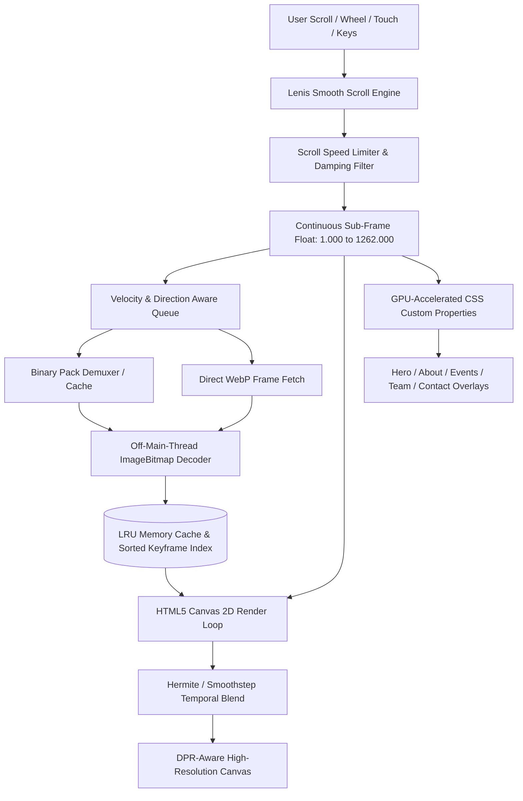

<div align="center">

  

  # E-Cell Woxsen — Where Builders Start
  
  **The Official Digital Experience of the Entrepreneurship Cell at Woxsen University**

  [](https://nextjs.org/)
  [](https://react.dev/)
  [](https://www.typescriptlang.org/)
  [](https://tailwindcss.com/)
  [](https://convex.dev/)
  [](https://www.cloudflare.com/products/r2/)
  [](https://lenis.darkroom.engineering/)
  [](https://bun.sh/)

  <p align="center">
    A cinematic, frame-by-frame 120 FPS scrollytelling platform engineered to showcase student ventures, flagship initiatives, leadership, and startup culture at Woxsen University.
  </p>

  <p align="center">
    <a href="#-overview">Overview</a> •
    <a href="#-key-features">Key Features</a> •
    <a href="#-scrollytelling-engine-architecture">Engine Architecture</a> •
    <a href="#-timeline--cinematic-chapters">Cinematic Chapters</a> •
    <a href="#-asset--streaming-pipeline">Asset & Streaming Pipeline</a> •
    <a href="#-backend--data-layer">Backend & Data Layer</a> •
    <a href="#-tech-stack">Tech Stack</a> •
    <a href="#-project-structure">Project Structure</a> •
    <a href="#-environment-variables">Environment Variables</a> •
    <a href="#-getting-started">Getting Started</a> •
    <a href="#-performance--engineering">Performance</a> •
    <a href="#-connect--community">Community</a>
  </p>

</div>

---

## 🌟 Overview

**E-Cell Woxsen** is founded on a core belief: *we build founders, not just businesses.*

This web platform bridges physical architecture and digital storytelling through a custom **Sub-Frame Canvas Scrollytelling Engine**. As the user scrolls, **1,262 high-definition virtual frames** (powered by 840 physical 3D WebP renders with seamless camera loops), ambient video layers, generative Web Audio synth soundscapes, and hardware-accelerated DOM overlays synchronize in real time to deliver an editorial exhibition across campus initiatives, flagship events, leadership, and startup pathways.

The production deployment features a **Dual-Delivery Asset Pipeline** backed by Cloudflare R2 and a custom Cloudflare Worker edge CDN with byte-range parsing, coupled with real-time contact and inquiry intake powered by **Convex**.

---

## ✨ Key Features

- 🎞️ **Sub-Frame Canvas Scrollytelling**: High-performance HTML5 2D canvas playback spanning **1,262 virtual timeline frames** with continuous Hermite / Smoothstep temporal blending for zero-stutter transitions on high-refresh displays (60Hz / 120Hz+).
- 📦 **Binary Pack Streaming Architecture (Track B)**: 16-frame chunked binary archives (`.bin`) with compact 4-byte offset headers, reducing over 840 individual network round-trips into ~53 sequential, streamable chunks with zero connection overhead.
- ☁️ **High-Performance Edge CDN & Cloudflare Worker**: Custom reverse proxy worker serving R2 assets with full HTTP/2+ multiplexing, Cache API edge caching, and strict RFC 7233 byte-range parsing for video streaming (`still_shot.mp4`).
- 🧠 **Velocity & Direction-Aware Memory Management**:
  - **Predictive Preloader**: Dynamically prioritizes forward and backward frame tiers (`1000` to `300`) based on real-time scroll velocity and direction.
  - **Dynamic LRU Cache Eviction**: Maintains strict memory caps across desktop and mobile devices, preventing tab crashes and out-of-memory errors during prolonged exploration.
  - **Off-Main-Thread Decoding**: Utilizes `createImageBitmap` and `HTMLImageElement.decode()` off the main thread to eliminate UI hitches.
- 🌊 **Inertial Momentum Scrolling with Lenis**: Calibrated damping physics, time-invariant exponential smoothing, and an active scroll-speed limiter that prevents frame dropouts during fast flick gestures.
- ⚡ **Critical Fast Boot**: Loads initial priority frames to render interactive hero visuals in `< 250ms` with an interactive neon progress splash loader (`PreloadManager.tsx`).
- 🎬 **Seamless Ambient Video Crossfade**: Looping ambient video (`still_shot.mp4`) seamlessly dissolves into the canvas timeline at the hero state for instant visual immersion before the first scroll interaction.
- 🎵 **Generative Web Audio Soundscape**: Built-in procedural ambient synthesizer (`AudioController.tsx`) featuring polyphonic warm sine/triangle oscillator pads, detuned harmonics, and low-frequency breathing modulation.
- 🧭 **Real-Time HUD & Interactive Floating Navigation**:
  - **Floating Pill Navbar (`Header.tsx`)**: Real-time section tracking, logo badge reset, and programmatic smooth jumps to chapters.
  - **Live Progress HUD (`ScrollProgressHUD.tsx`)**: Real-time chapter indicators (`CH 01` to `CH 06`), percentage counter, and progress gauge.
- 🏛️ **Cinematic Overlay Systems**:
  - **Hero Landing (Frames 1–35)**: Staggered typography letter-reveal, ambient emerald glow, audio toggle, and dual CTAs.
  - **3-Column Architectural Story (Frames 350–425)**: Core pillars (*Build First*, *Venture Incubation*, *Capital Network*) with localized radial contrast grading.
  - **Dynamic Exhibition Wall Gallery (Frames 598–1262)**: Smooth horizontal camera tracking across Flagship Events, Core Leadership & Mentors, and the Interactive Contact Hub with spotlight shaders and active card detection.
- ⚡ **Real-Time Convex Data Layer**: Contact submissions and visitor inquiries are validated, deduplicated, and stored in Convex with anti-spam rate limiting (3 submissions/min) and notification dispatch.
- 📋 **Multi-Track Application Modal**: Glassmorphic modal (`JoinApplyModal.tsx`) with specialized intake paths for student membership, startup idea pitches, and corporate partnerships.
- 📄 **Institutional Resource Access**: Direct one-click download for the official *E-Cell Woxsen Service Portfolio* PDF.

---

## 📐 Scrollytelling Engine Architecture



### Hermite Sub-Frame Interpolation
Rather than discrete frame snapping, the engine continuously calculates Hermite / Smoothstep curve weights between adjacent keyframes `Frame A` and `Frame B`:

$$S(t) = 3t^2 - 2t^3 \quad \text{where} \quad t = \text{frame}_{\text{current}} - \lfloor \text{frame}_{\text{current}} \rfloor$$

This produces seamless, photographic cross-dissolves at 60Hz, 120Hz, and high-refresh displays without stepping artifacts.

### Zero-Reflow GPU Transform Pipeline
Overlay positions and opacities are synced to canvas frames using CSS Custom Properties updated via `requestAnimationFrame`:
```css
/* Dynamically bound CSS variables */
--gallery-tx: -2450px;
--gallery-opacity: 1;
--hero-opacity: 0;
--door-opacity: 1;
```
This bypasses React re-render cycles during rapid scrolling and delegates layout updates directly to the browser compositor thread (`translate3d`).

---

## 🗺️ Timeline & Cinematic Chapters

The timeline spans **1,262 virtual frames**. Physical render assets cover frames 1 to 840, while virtual frames 841 to 1262 loop seamlessly across the wall exhibition corridor (frames 625 to 840, a 216-frame cycle) to provide an extended, continuous gallery walk.

| Chapter | Frame Range | Section | Visual Scene & Experience |
| :---: | :--- | :--- | :--- |
| **01** | **`0001` – `0035`** | **Hero Section** | Cinematic establishing shot with ambient video overlay, display typography, and dual CTAs. |
| **02** | **`0350` – `0425`** | **About / The Doorway** | 3-Column architectural layout detailing E-Cell's vision, core incubation pillars, and campus footprint. |
| **03** | **`0425` – `0598`** | **Inside Headquarters** | Camera travels through the physical innovation corridor into the exhibition space. |
| **04** | **`0598` – `0860`** | **Flagship Initiatives** | Horizontal gallery showcasing **Hult Prize**, **Panel Discussion**, and **Game Night** with dynamic spotlight illumination and interactive cards. |
| **05** | **`0860` – `1140`** | **Core Leadership & Mentors** | Faculty advisors, mentors, executive leadership, secretaries, and department heads presented in curated contact sheets. |
| **06** | **`1140` – `1262`** | **Community & Connect** | Architectural contact wall with direct Convex inquiry form, social channels, campus coordinates, and Service Portfolio download. |

---

## 📦 Asset & Streaming Pipeline

To achieve instant load times and fluid 120 FPS playback without exhausting mobile memory or browser connection pools, the platform employs a specialized multi-tier asset architecture:

```
[ Raw Render Sequences ]
         │
         ▼  (scripts/resize-gallery-assets.ts)
[ Multi-Resolution WebP Variants ]
 ├── ecell_shots/               (1080p Desktop)
 ├── ecell_shots_720p/          (720p Balanced)
 └── ecell_shots_mobile_720p/   (720p Mobile-Optimized)
         │
         ▼  (scripts/pack-frames.ts, pack-events.ts, pack-team.ts)
[ Binary Frame & Asset Packs ]
 └── ecell_packs/               (53x 16-frame .bin packs + events/team packs)
         │
         ▼  (scripts/upload-to-r2.ts)
[ Cloudflare R2 Storage Bucket ]
         │
         ▼
[ Cloudflare Worker Edge CDN (worker/) ]
 ├── HTTP/2+ Multiplexed Streaming
 ├── Byte-Range RFC 7233 Slicing (MP4 video seek)
 └── Immutable Edge Cache API Caching
```

### Frame Pack Binary Layout
Each binary pack bundles 16 WebP frames into a single file with a contiguous header:
```text
┌────────────────────────────────────────────────────────┐
│ Header: [File 0 Offset] [File 1 Offset] ... [File N]  │
├────────────────────────────────────────────────────────┤
│ Payload: Raw WebP 0 | Raw WebP 1 | Raw WebP 2 ...     │
└────────────────────────────────────────────────────────┘
```
The browser demuxer slices offsets via `ArrayBuffer.slice` and creates image blobs locally, completely eliminating per-frame HTTP handshake latency.

---

## ⚡ Backend & Data Layer

The platform integrates **Convex** as its real-time reactive backend for interactive visitor interactions and institutional data management:

- **Contact Form Ingestion (`convex/contacts.ts`)**:
  - Live visitor inquiries submitted from the interactive contact wall.
  - Strict input validation (email format, message length bounds).
  - Anti-spam rate limiting allowing max 3 submissions per minute per email.
  - In-flight deduplication of identical messages within 60 seconds.
- **Enterprise Schema (`convex/schema.ts`)**:
  - Scalable data models for team directory, user roles, department metadata, and submission management.
- **Convex Client Provider (`app/ConvexClientProvider.tsx`)**:
  - Zero-latency client sync with automatic reconnect and optimistic UI updates.

---

## 🛠️ Tech Stack

| Category | Technology | Purpose |
| :--- | :--- | :--- |
| **Framework** | [Next.js 16.3.1](https://nextjs.org/) (App Router, Turbopack) | Server & client component orchestration, asset optimization |
| **UI Library** | [React 19.2.8](https://react.dev/) | Concurrent UI rendering, ref-based canvas integration |
| **Backend & DB** | [Convex 1.45.0](https://convex.dev/) | Real-time reactive data layer, inquiry submission & anti-spam |
| **Edge CDN** | [Cloudflare Workers](https://workers.cloudflare.com/) + [R2](https://www.cloudflare.com/products/r2/) | High-speed asset delivery, HTTP/2+ multiplexing, range streaming |
| **Language** | [TypeScript 5](https://www.typescriptlang.org/) | Strict type safety across components, workers, and build scripts |
| **Styling** | [Tailwind CSS v4](https://tailwindcss.com/) + PostCSS | Modern CSS utility tokens, custom animations, glassmorphism |
| **Smooth Scroll** | [Lenis 1.3.26](https://lenis.darkroom.engineering/) | Inertial momentum scrolling with customizable damping |
| **Audio Engine** | Web Audio API | Procedural, zero-bandwidth polyphonic ambient sound synthesizer |
| **Image Processing** | [Sharp 0.35.3](https://sharp.pixelplumbing.com/) | Automated batch image compression, resizing, and binary packing |
| **Icons** | [Lucide React](https://lucide.dev/) | Crisp, modern vector UI iconography |
| **Typography** | `Bebas Neue`, `DM Sans`, `Space Mono` | Display, body, and technical mono font pairing |
| **Runtime & PM** | [Bun 1.3.12](https://bun.sh/) / Node.js | Fast package management, script execution, and local dev |

---

## 📁 Project Structure

```text
ecell_new_website/
├── app/
│   ├── components/
│   │   ├── Header.tsx                 # Glassmorphic floating pill navbar with frame jumps
│   │   ├── PreloadManager.tsx         # Splash screen with frame progress & neon pulse
│   │   ├── ScrollytellingEngine.tsx   # Canvas render loop, queue manager, Lenis & Hermite blending
│   │   ├── modals/
│   │   │   └── JoinApplyModal.tsx     # Multi-track application modal (Student / Startup / Partner)
│   │   ├── overlays/
│   │   │   ├── HeroOverlay.tsx        # Hero headline with staggered character animation
│   │   │   ├── DoorAboutOverlay.tsx   # About story & 3-column architectural pillar layout
│   │   │   ├── WallGalleryOverlay.tsx # Horizontal tracking container for gallery sections
│   │   │   ├── EventsWallSection.tsx  # Flagship events with spotlight shaders & photo frames
│   │   │   ├── EventsWallCard.tsx     # Alternative event cards grid with quick pitch CTA
│   │   │   ├── TeamWallSection.tsx    # Leadership & mentor contact sheets
│   │   │   ├── TeamWallCards.tsx      # Modular core team grid component
│   │   │   ├── ContactWallSection.tsx # Architectural contact wall with Convex inquiry form
│   │   │   └── ContactWallCard.tsx    # Modular contact card with campus metadata & social links
│   │   └── ui/
│   │       ├── AudioController.tsx    # Procedural Web Audio synthesizer for ambient soundscape
│   │       └── ScrollProgressHUD.tsx  # Real-time chapter tracker, frame counter & timeline gauge
│   ├── lib/
│   │   ├── assets.ts                  # R2 asset loader, URL resolver & frame loop mappings
│   │   ├── eventsPack.ts              # Binary demuxer for packed event exhibition imagery
│   │   └── teamPack.ts                # Binary demuxer for packed team portraits
│   ├── ConvexClientProvider.tsx       # React provider for Convex real-time client
│   ├── error.tsx                      # Next.js route error boundary
│   ├── global-error.tsx               # Root application error boundary
│   ├── globals.css                    # Tailwind CSS v4 setup, custom fonts & glass styles
│   ├── layout.tsx                     # Root HTML structure, OpenGraph metadata & Google Fonts
│   └── page.tsx                       # Master page coordinator & state bridge
├── convex/
│   ├── _generated/                    # Auto-generated Convex types and client bindings
│   ├── contacts.ts                    # Public inquiry mutation, rate limiting & anti-spam validation
│   └── schema.ts                      # Convex database schema (users, departments, roles, contacts)
├── worker/
│   ├── src/
│   │   └── index.ts                   # Cloudflare Worker reverse proxy with byte-range & cache logic
│   └── wrangler.toml                  # Cloudflare Worker configuration & R2 bucket binding
├── scripts/
│   ├── pack-events.ts                 # Compiles event images into binary pack
│   ├── pack-frames.ts                 # Compiles 16-frame WebP sequence chunks into binary packs
│   ├── pack-team.ts                   # Compiles team portrait images into binary pack
│   ├── resize-gallery-assets.ts       # Sharp batch image optimization & responsive resizing
│   ├── test-assets.ts                 # CDN asset health check & HTTP status validation
│   └── upload-to-r2.ts                # Fast multi-threaded S3/R2 asset synchronizer
├── public/
│   ├── ecell_shots/                   # 1080p high-resolution sequence frames (WebP)
│   ├── ecell_shots_720p/              # 720p responsive sequence frames
│   ├── ecell_packs/                   # Pre-compiled binary packs (.bin)
│   ├── events/                        # Flagship event exhibition imagery
│   ├── team/                          # Core team & mentor portraits
│   ├── ecell-logo.png                 # Official E-Cell brand insignia
│   ├── still_shot.mp4                 # Ambient looping video for hero background
│   └── ECell_Woxsen_ServicePortfolio.pdf # Official institutional portfolio
├── package.json                       # Scripts, dependencies & trusted binary configs
├── tsconfig.json                      # Strict TypeScript compiler options
└── next.config.ts                     # Next.js configuration
```

---

## ⚙️ Environment Variables

Create a `.env` file in the project root:

```bash
# --- Convex Backend ---
CONVEX_DEPLOYMENT=dev:your-deployment-name
NEXT_PUBLIC_CONVEX_URL=https://your-deployment.convex.cloud
NEXT_PUBLIC_CONVEX_SITE_URL=https://your-deployment.convex.site

# --- Cloudflare R2 & Worker CDN ---
NEXT_PUBLIC_R2_PUBLIC_URL=https://ecell-assets-cdn.your-subdomain.workers.dev
R2_PUBLIC_URL=https://ecell-assets-cdn.your-subdomain.workers.dev

# --- Cloudflare R2 S3 API (For upload scripts) ---
R2_ACCESS_KEY_ID=your_access_key_id
R2_SECRET_ACCESS_KEY_ID=your_secret_access_key
R2_ENDPOINT=https://your_account_id.r2.cloudflarestorage.com
R2_BUCKET_NAME=ecell-main-website
```

---

## 🚀 Getting Started

### Prerequisites

Ensure you have one of the following installed:
- **[Bun](https://bun.sh/)** *(Recommended for fastest install, execution & build times)*
- **[Node.js](https://nodejs.org/)** (v18.18+ or v20+)

### 1. Clone the Repository

```bash
git clone git@github.com:ecell-woxsen/ecell-new-website.git
cd ecell-new-website
```

### 2. Install Dependencies

Using **Bun**:
```bash
bun install
```

Or using **npm**:
```bash
npm install
```

### 3. Run Development Server

```bash
bun dev
# or
npm run dev
```

Open [http://localhost:3000](http://localhost:3000) in your browser to view the application.

### 4. Build for Production

```bash
bun run build
bun run start
```

### 5. Asset Pipeline & Packaging Scripts

When updating raw sequence frames or gallery assets, execute the packaging scripts:

```bash
# Resize & optimize gallery imagery
bun run resize:gallery

# Pack 16-frame chunks into binary archives (.bin)
bun run pack:frames

# Pack event & team imagery into binary archives
bun run pack:events
bun run pack:team

# Upload optimized assets and binary packs directly to Cloudflare R2
bun run upload:r2
```

### 6. Deploying the Asset CDN Worker

To deploy or update the Cloudflare Worker asset proxy:

```bash
cd worker
npx wrangler login
npx wrangler deploy
```

---

## ⚡ Performance & Engineering

- **Off-Main-Thread Decoding**: Frames are fetched and parsed via `createImageBitmap` and `HTMLImageElement.decode()` off the main thread, maintaining fluid frame rates during rapid scrolling.
- **Binary Search Keyframe Resolution**: Nearest loaded keyframe resolution uses $O(\log N)$ binary search across a sorted index array for immediate frame fallback.
- **Active Scroll Limiter**: Dynamic velocity tracking throttles excessive wheel acceleration to keep frame decoding balanced with viewport updates.
- **High-DPR Aspect Ratio Fit**: Canvas sizing dynamically computes `devicePixelRatio` and letterbox/cover aspect ratio fit to ensure crisp rendering on 4K, Retina, and mobile viewports.
- **GPU-Accelerated Compositing**: All spatial movements (`--gallery-tx`, `--hero-ty`) use `translate3d()` transforms to avoid triggering CPU paint cycles.
- **Memory-Bounded Cache**: Dynamic LRU cache eviction protects low-RAM mobile browsers from tab crashes while preserving smooth playback.

---

## 🤝 Connect & Community

- **Campus Address**: Woxsen University, Sadasivpet, Hyderabad, Telangana 502345, India
- **Email**: [ecell@woxsen.edu.in](mailto:ecell@woxsen.edu.in)
- **Instagram**: [@ecell_wou](https://instagram.com/ecell_wou) / [@ecell_woxsen](https://instagram.com/ecell_woxsen)
- **LinkedIn**: [E-Cell Woxsen University](https://linkedin.com/company/ecell-woxsen)
- **Website**: [woxsen.edu.in/ecell](https://woxsen.edu.in/ecell)

---

<div align="center">
  <sub>Engineered & Designed with ❤️ by the <strong>E-Cell Woxsen Team</strong>.</sub>
</div>
